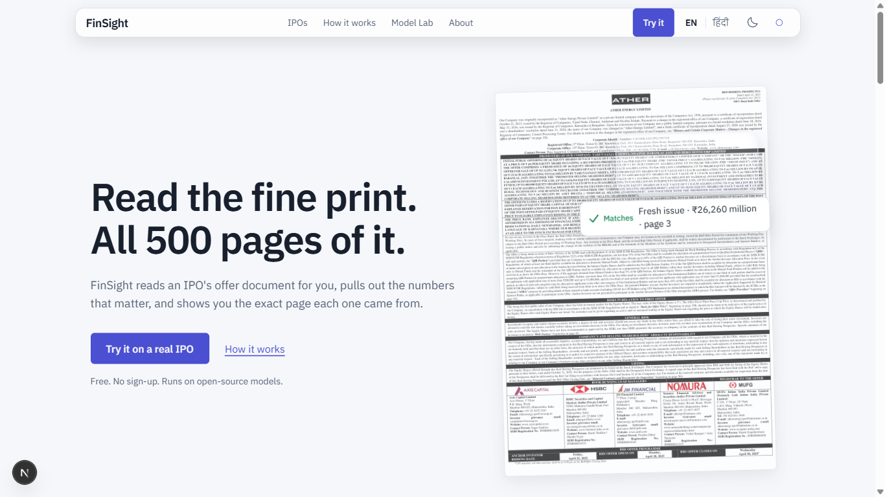
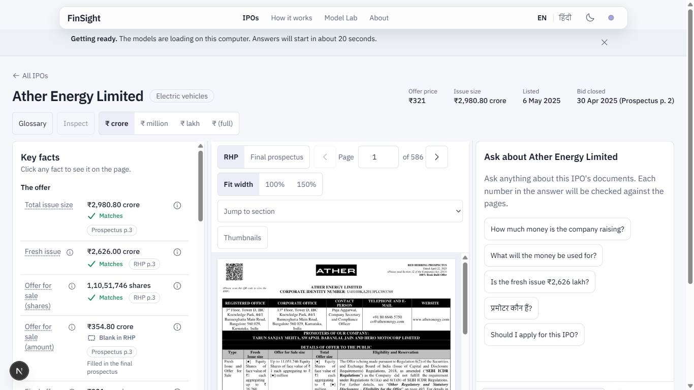
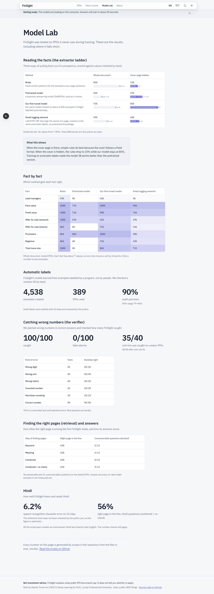
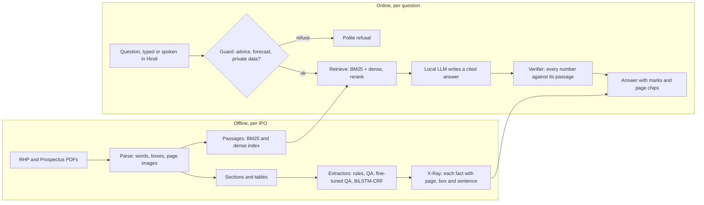
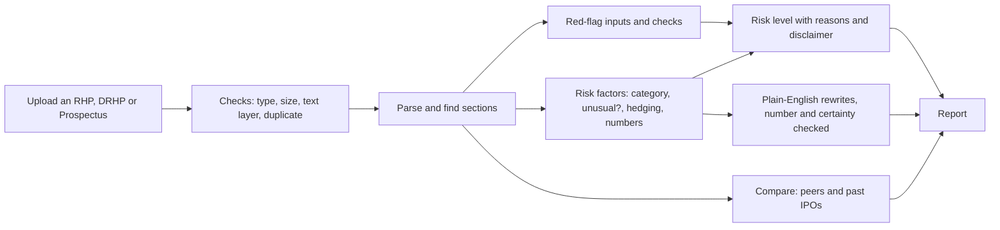

# FinSight — IPO X-Ray for Indian retail investors

[](https://github.com/AkshatTm/FinSight-IPO-X-Ray-for-Indian-retail-investors/actions/workflows/backend.yml)
[](https://github.com/AkshatTm/FinSight-IPO-X-Ray-for-Indian-retail-investors/actions/workflows/frontend.yml)
[](https://github.com/AkshatTm/FinSight-IPO-X-Ray-for-Indian-retail-investors/actions/workflows/docs.yml)
[](LICENSE)


**FinSight reads an Indian IPO prospectus and shows a fact sheet where every figure is cited to its page, then answers questions in English or Hindi and marks every number in the answer ✅ verified, ⚠️ unverifiable or ❌ contradicted.** Phase 2 adds uploads: give it any IPO offer document and it builds a report with red flags, the risk factors in plain English, a risk level with its reasons, and comparisons with peers and past IPOs. Every model is open-weight.

**Not investment advice.** FinSight summarises public disclosures. It never recommends whether to apply, buy or sell, and never predicts a price. The risk level describes what the document discloses, with its reasons and a disclaimer; it is not a rating.

Course project for CSE472 (Deep Learning for NLP), due 1 November 2026.



| Fact sheet with the source page | Model Lab |
|---|---|
|  |  |

## How it works



### Phase 2: upload any offer document



FinSight runs on the laptop: the API and the upload pipeline in one process, models through Ollama or llama.cpp, SQLite and local files. Supabase sign-in and Postgres are optional. Google Cloud was dropped when the credit ran out (B-ADR-16). See the [architecture page](docs/architecture/index.md).

Two ideas carry the project. The extractor is trained without hand labels: seeds from cover-page rules are propagated across 389 older prospectuses and used to fine-tune a QA model (distant supervision). The number check involves no model: each number in an answer is normalised (lakh, crore, million, Hindi words and digits) and compared with the number in the passage the answer cites.

## Results

Generated from `eval_results/` by `scripts/readme_results.py`; each number is on seven test IPOs or a small question set, so read the files for the intervals. The report drafts in `report/` list every caveat (AI-assisted gold labels, tuned and held-out numbers, one-run LLM scores).

<!-- results:start -->
| Experiment | Metric | Result | File |
|---|---|---|---|
| Extractor ladder, Rung 1: rules | NVM, 7 test IPOs | full 0.86, body-only 0.23 | `ladder_table.json` |
| Extractor ladder, Rung 2: pretrained QA | NVM, 7 test IPOs | full 0.36, body-only 0.37 | `ladder_table.json` |
| Extractor ladder, Rung 3: fine-tuned QA | NVM, 7 test IPOs | full 0.74, body-only 0.85 | `ladder_table.json` |
| Extractor ladder, Rung 4: BiLSTM-CRF | NVM, 7 test IPOs | full 0.49, body-only 0.28 | `ladder_table.json` |
| Number verifier, seeded errors | scale-mismatch recall, held out | 35/40 [0.74, 0.95] | `verifier.json` |
| Advice guard (keyword), in-sample | block / false-block | 60/60 / 0/60 | `guard.json` |
| Retrieval, bm25 | recall@1 / recall@5, 56 test questions | 0.30 / 0.62 | `retrieval.json` |
| Retrieval, hybrid+rerank | recall@1 / recall@5, 56 test questions | 0.46 / 0.61 | `retrieval.json` |
| Chat answers (E7, dev), one run | numbers marked ✅ | 0.76 of 68 | `e7.json` |
| Chat answers (E7, test), one run | numbers marked ✅ | 0.69 of 86 | `e7.json` |
<!-- results:end -->

## Run locally

```bash
uv sync                          # Python 3.11, dev + api + data groups
uv run poe test                  # fast tests
uv run poe lint && uv run poe typecheck
uv run poe api                   # FastAPI on :8000 (FINSIGHT_PROFILE=dev_light while coding)
cd frontend && pnpm install && pnpm dev    # http://localhost:3000
NEXT_PUBLIC_USE_MOCKS=1 pnpm dev            # the site on fixtures, no backend
```

Documentation site: `uv sync --group docs` then `uv run poe docs` (http://localhost:8000; the API uses the same port, so stop one first). It holds tutorials, how-to guides, the API and configuration reference, the [evaluation page](docs/evaluation.md), model cards, datasheets and runbooks; [troubleshooting](docs/troubleshooting.md) lists the 15 most common problems.

The PDFs are public filings but are not in the repository. To rebuild an IPO: put its RHP and Prospectus under `data/raw/` as listed in `configs/demo_ipos.yaml`, then `uv run python -m finsight.pipeline build --ipo <id>`. Chat needs [Ollama](https://ollama.com) with `qwen3.5:2b` (profile `full`). Model work needs `uv sync --group ml` (CUDA PyTorch) and, for voice, `--group asr`; training ran on Kaggle only. Planning documents: [`docs/00_README.md`](docs/00_README.md) (Phase 1) and [`docs/phase2/B00_README.md`](docs/phase2/B00_README.md) (Phase 2); decisions: [ADR index](docs/adr/index.md).

## Limitations

- Scores rest on small, AI-assisted gold sets (7 test IPOs for the extractors); the [evaluation page](docs/evaluation.md) lists every caveat.
- Phase 2 thresholds and past-IPO reference values are provisional placeholders until the local runs over the 2018–2023 corpus replace them; the pages say so.
- Chat answers come from small local models and can be wrong; the verifier marks numbers, not reasoning.
- Hindi output is checked by one reviewer.

## Contributing, security and privacy

[CONTRIBUTING.md](CONTRIBUTING.md) · [SECURITY.md](SECURITY.md) · [PRIVACY.md](PRIVACY.md) · [CHANGELOG.md](CHANGELOG.md) · [Code of conduct](CODE_OF_CONDUCT.md)

## Licences

Code: MIT ([`LICENSE`](LICENSE)). The weak-label corpus (Ghosh et al., Hugging Face `sohomghosh/Indian_IPO_datasets`) is CC BY-NC-SA 4.0, so any model trained on it is non-commercial and is not published ([`NOTICE`](NOTICE)). RHPs and Prospectuses are public SEBI and exchange filings. Base models keep their own licences.

## What I learned

*To be written by Akshat.*
