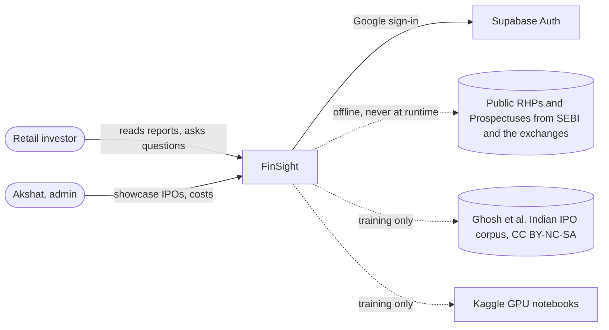
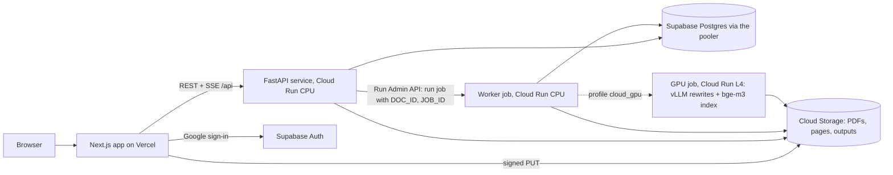
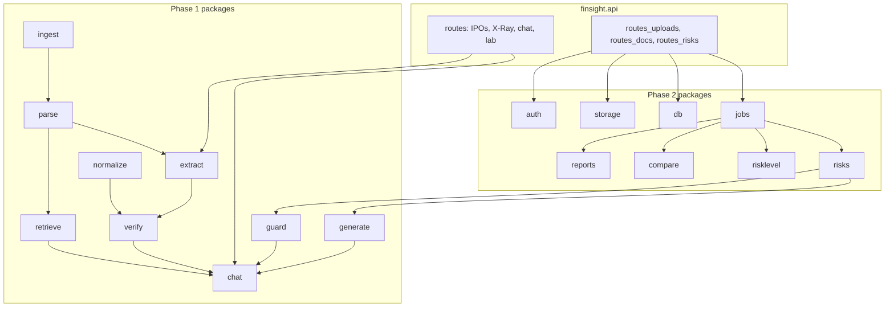
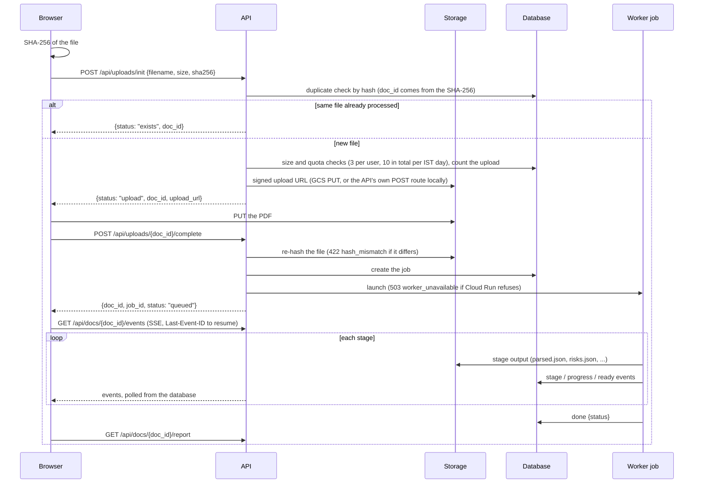
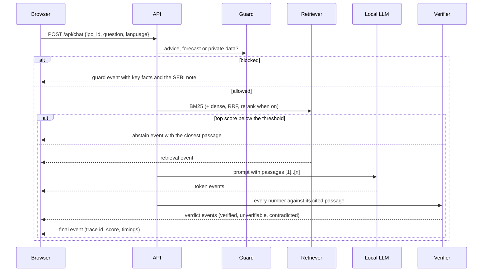
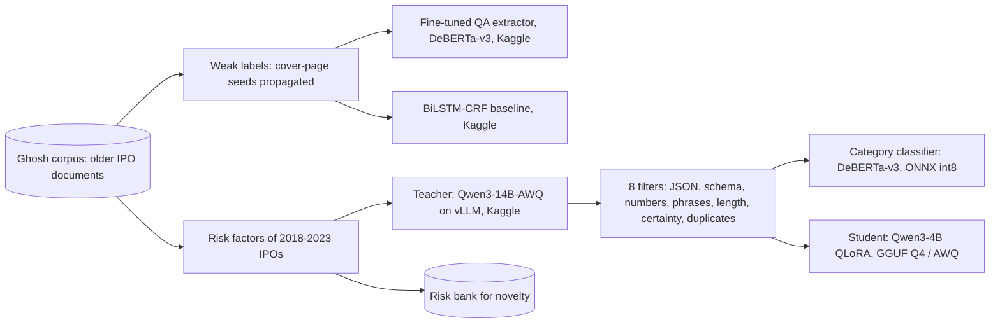

# Architecture

This page shows FinSight at three levels of the C4 model (context, containers, components), then the two main flows: upload and chat. The final section shows how the training data is made. The design decisions behind it are in [B02 Architecture](../phase2/B02_ARCHITECTURE.md) and the [ADR index](../adr/index.md).

## Level 1: system context

FinSight explains what an offer document says. It never recommends whether to apply, buy, sell or avoid, and every model is open-weight (no hosted LLM API at runtime, ADR-002).

## Level 2: containers

| Container | Code | Profile | Notes |
| --- | --- | --- | --- |
| Web app | `frontend/` | — | MSW mocks with `NEXT_PUBLIC_USE_MOCKS=1` |
| API | `finsight.api` (`deploy/api.Dockerfile`) | `cloud` | No PyTorch; BM25 chat; scales to zero |
| Worker job | `python -m finsight.jobs run` (`deploy/worker.Dockerfile`) | `cloud` | Every stage; top-15 rewrites with the student GGUF when there is no GPU |
| GPU job | `deploy/gpu.Dockerfile` | `cloud_gpu` | Optional; rewrites and dense index only |
| Laptop | same API, in-process worker, SQLite, local files, Ollama | `dev_light`, `full` | See [Run FinSight locally](../tutorials/run_locally.md) |

Nothing is deployed yet: the definitions live in `deploy/gcp/` and wait for Akshat's "go" (see the [deploy runbook](../runbooks/DEPLOY_RUNBOOK.md)).

## Level 3: backend components

Each package lives in `src/finsight/<package>/`; other packages import it only through its `__init__.py`. The [Python packages reference](../reference/python.md) is generated from the docstrings.

## Upload sequence

## Chat sequence

## Training data flow

Every training run happens on Kaggle (never on the laptop or in a cloud session). Labels written by a model carry `label_source`, and their datasheets say so: see [Teacher outputs](../phase2/datasheets/teacher_outputs.md).
