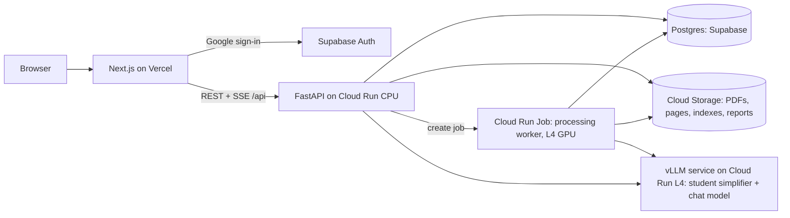
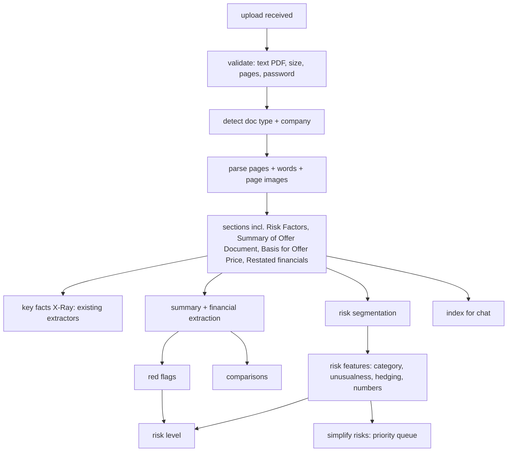

# B02 — Architecture (Big Phase 2)

## 1. Principles (additions to Phase 1 §1)

1. **Same code locally and in the cloud.** Storage, database, queue and LLM sit behind adapters chosen by profile (`dev_light`, `full`, `cloud`). No `if cloud:` branches in business logic.
2. **Progressive, stage-by-stage results.** Every stage writes its output and an event; the UI renders whatever is ready. A failed stage never deletes earlier results.
3. **Deterministic first, models second.** Red flags and the risk level are rules over extracted values; models extract, classify and simplify; the verifier checks numbers.
4. **Pay only while working.** GPU work runs in jobs that scale to zero.
5. **Documents are content-addressed.** `doc_id = sha256(pdf)[:16]`; same file → same report.

## 2. System context



Locally: the same FastAPI app, SQLite instead of Postgres, the local filesystem instead of GCS, an in-process worker instead of Cloud Run Jobs, Ollama instead of vLLM.

## 3. Processing pipeline (per uploaded document)



### 3.1 Stages, outputs and events

| # | Stage id | Output (in `docs/<doc_id>/`) | Event payload (B06) | Budget (cloud, 600 pages) |
|---|---|---|---|---|
| 1 | `received` | `source.pdf`, metadata row | `{stage, status}` | — |
| 2 | `validated` | — / rejection reason | `{ok, reason?}` | 2 s |
| 3 | `detected` | `doc.json` (type, company, pages) | `{doc_type, company, pages}` | 5 s |
| 4 | `parsed` | `parsed.json`, `pages/*.webp`, `words/*.json` | `{pages_done, pages_total}` (every 50 pages) | 40 s |
| 5 | `sections` | `sections.json` | `{found: [...]}` | 5 s |
| 6 | `facts` | `xray.json` | `{ready: true}` | 20 s |
| 7 | `financials` | `summary.json` | `{ready}` | 30 s |
| 8 | `redflags` | `redflags.json` | `{ready, counts}` | 2 s |
| 9 | `risks_split` | `risks.json` (raw) | `{n_risks}` | 10 s |
| 10 | `risks_scored` | `risks.json` (+ features) | `{ready}` | 30 s |
| 11 | `risk_level` | `risklevel.json` | `{level}` | 1 s |
| 12 | `simplify` | `risks.json` (+ rewrites, streamed) | `{done, total}` (each item) | ≤ 5 min |
| 13 | `index` | `chunks.jsonl`, `bm25/`, `faiss.index` | `{ready}` | 60 s |
| 14 | `compare` | `compare.json` | `{ready}` | 5 s |
| 15 | `done` / `failed` | `report.json` (assembled) | `{status, failed_stages}` | — |

Stages 6–8, 9–10 and 13 can run in parallel after stage 5. Stage 12 consumes a **priority queue**: default order = importance; a user click (`POST …/risks/{rid}/simplify`) bumps that risk to the front.

### 3.2 Document-type handling

| Type | Detection cue (first 3 pages) | Behaviour |
|---|---|---|
| RHP | "RED HERRING PROSPECTUS" (not "DRAFT") | Normal; price-dependent amounts may be `[●]` |
| DRHP | "DRAFT RED HERRING PROSPECTUS" | Banner; many `[●]`; red flags needing prices → "Not available yet" |
| Prospectus | "PROSPECTUS" without "RED HERRING" | Prices filled; preferred for price-dependent checks |
| Unknown | none of the above + missing ≥ 3 key sections | Reject: "This doesn't look like an IPO offer document." |

Showcase IPOs keep both RHP and Prospectus (Phase 1 companion mechanism). Uploads are single documents; if a user later uploads the Prospectus of a company that already has an RHP report, link them as companions (same company name + issue).

## 4. New and changed packages

| Package | Responsibility | Public API (examples) | Phase |
|---|---|---|---|
| `storage` (new) | `Storage` protocol: `LocalStorage`, `GCSStorage`; signed URLs | `get_storage().put/get/url()` | B1.2 |
| `db` (new) | Repository layer over SQLite (local) / Postgres (cloud); migrations (Alembic) | `docs_repo`, `jobs_repo`, `users_repo` | B1.2 |
| `jobs` (new) | Job model, stage runner, event emitter, priority queue, retries, idempotency | `submit(doc_id)`, `run_stage()`, `events(doc_id)` | B1.2 |
| `auth` (new) | Verify Supabase JWT; per-user limits | `current_user()`, `check_quota()` | B1.5 |
| `ingest.upload` (new) | Validation, dedupe, doc-type detection | `validate_pdf()`, `detect_type()` | B1.1 |
| `parse` (changed) | Robust to unseen layouts; page limit; timeouts | — | B1.1 |
| `summary` (new) | Extract Summary of Offer Document, restated financials, WACA, litigation, RPT, shareholding, peers | `extract_summary(doc)` | B1.3 |
| `redflags` (new) | Rules from `configs/redflags.yaml`; sector awareness | `evaluate(summary, xray) -> list[RedFlag]` | B1.4 |
| `risks` (new) | `segment`, `bank`, `novelty`, `hedging`, `numbers`, `classify`, `seriousness`, `simplify` | `build_risk_report(doc)` | B2 |
| `risklevel` (new) | Points system + corpus-relative thresholds | `compute(redflags, risks) -> RiskLevel` | B2.6 |
| `compare` (new) | Peer table + corpus percentiles | `compare(doc)` | B3.2 |
| `reports` (new) | Assemble `report.json`; caching | `get_report(doc_id)` | B1.2+ |
| `generate` (changed) | `VLLMBackend` (OpenAI-compatible HTTP to our own vLLM server) beside Ollama | — | B3.3 |
| `guard` (changed) | Allow risk-level questions; still refuse buy/apply; forbidden-words output filter for rewrites | — | B2.5 |

Module contract rule unchanged: import other packages only via `__init__`.

## 5. Schemas (additions to `core/schemas.py`)

```python
DocType = Literal["rhp", "drhp", "prospectus", "unknown"]
Status3 = Literal["ok", "watch", "concern", "not_available", "not_applicable"]
Level = Literal["low", "medium", "high"]
RiskCategory = Literal["financial", "debt_liquidity", "customers_suppliers", "competition",
  "legal_litigation", "regulatory", "promoters_governance", "operations", "technology_data",
  "market_macro"]

class DocRecord(BaseModel): doc_id: str; sha256: str; doc_type: DocType; company: str | None
    pages: int; uploaded_by: str | None; is_showcase: bool; companion_of: str | None
    created_at: datetime; status: Literal["processing", "ready", "partial", "failed"]

class Job(BaseModel): job_id: str; doc_id: str; stage: str; status: Literal["queued","running","done","failed"]
    progress: dict; error: str | None; started_at: datetime | None; finished_at: datetime | None

class Evidence(BaseModel): doc_id: str; page: int; bbox: BBox | None; sentence: str | None

class SummaryValue(BaseModel): key: str; value: Amount | Percent | Count | str | None
    period: str | None; evidence: Evidence | None; status: Literal["found","placeholder","not_found"]

class FinancialSummary(BaseModel): doc_id: str; currency_unit: str
    revenue: list[SummaryValue]; profit_after_tax: list[SummaryValue]; operating_cash_flow: list[SummaryValue]
    total_borrowings: SummaryValue; net_worth: SummaryValue; waca: list[SummaryValue]
    litigation: dict[str, SummaryValue]; rpt_total: SummaryValue; promoter_holding_post: SummaryValue
    pledged_pct: SummaryValue; customer_top1_pct: SummaryValue; customer_top10_pct: SummaryValue
    peers: list[dict]; auditor_remarks: list[SummaryValue]; is_financial_company: bool

class RedFlag(BaseModel): id: str; title: str; status: Status3; sentence: str
    numbers_used: dict[str, str]; evidence: list[Evidence]; rule: str; points: int

class Risk(BaseModel): rid: str; order: int; title: str; body: str; page_start: int; page_end: int
    category: RiskCategory | None; category_conf: float | None
    novelty: float | None            # share of past IPOs with a similar risk (0–1); lower = more unusual
    nearest_examples: list[dict]     # up to 3 similar past risks (company, year, title)
    hedging: dict                    # {hedge_count, hard_fact: bool, flag: bool}
    numbers: list[Amount]
    seriousness: Literal["high","medium","low"] | None; importance: float | None
    simple: str | None; simple_status: Literal["pending","ready","rejected","failed"]
    simple_checks: list[CheckResult]

class RiskLevel(BaseModel): level: Level; points: int; percentile: float
    reasons: list[dict]              # {source: "redflag"|"risk", id, label, points, link}
    thresholds: dict; corpus_n: int; disclaimer_key: str
```

## 6. Risk segmentation (B2.1)

- **Uploaded/showcase PDFs:** inside the Risk Factors section, a new risk starts at a line that is bold (from PyMuPDF spans) and/or numbered (`^\d{1,3}\.` / `^\(\w+\)`) and ends with a full stop or is ≤ 3 lines long. Merge across page breaks; strip running headers/footers (already done). Sub-headings like "Internal Risks", "External Risks", "Risks Relating to the Offer" become a `group` field, not risks.
- **Corpus texts (no font info):** numbered headings + sentence-shape rules; quality measured separately (E13b).
- Output: `title` (the bold heading), `body` (following paragraphs).

## 7. Risk features and the risk level

### 7.1 Unusualness (risk bank)
- Build once: segment the Risk Factors of all corpus IPOs → `risk_bank.parquet` (company, year, title, body, embedding). Embeddings: bge-m3 on the risk **title + first 2 sentences**.
- For a new risk: nearest neighbours (cosine) in the bank; `novelty = share of distinct past IPOs with at least one risk above similarity τ` (τ tuned on dev with spot checks, e.g. 0.80). Show "Found in {x}% of past IPOs" and up to 3 nearest examples.
- Exclude the same company's own past documents from the comparison.

### 7.2 Hedging / softening
- Count hedges ("may", "could", "might", "cannot assure", "there can be no assurance", "adversely affect", "materially") using a lexicon (Loughran–McDonald uncertainty + our own list).
- `hard_fact = true` if the risk contains past-tense facts with numbers (e.g. "we incurred a loss of ₹…", "in Fiscal 2025, 61% of our revenue…").
- `flag = hedge_count ≥ 3 and hard_fact` → UI note: "Written cautiously, but it describes something that has already happened."

### 7.3 Seriousness and importance
- Seriousness (rule-based, transparent): start from the category's base weight (financial, debt, legal, promoters = high base); +1 if `hard_fact`; +1 if a number exceeds a materiality threshold (e.g. ≥ 10% of revenue / net worth when known); −1 if novelty > 0.8 (boilerplate). Map to High/Medium/Low. Teacher-rated seriousness on 300 corpus risks is used only to **check** this rule (E17), not to train it.
- Importance (for sorting) = seriousness weight × (1 − novelty), ties by document order.

### 7.4 Risk level (B2.6)
- Points: each red flag Concern = 2, Watch = 1; each risk that is High seriousness **and** novelty < 0.10 = 1 (max 4 from risks).
- Thresholds are **corpus-relative**: compute points for all corpus IPOs (where extractable); Low = bottom third, Medium = middle third, High = top third. Store the thresholds in `configs/risklevel.yaml` with the date and corpus size.
- Output always includes reasons with points and links, the percentile ("more disclosed risk than 72% of past IPOs"), and the disclaimer key.

## 8. Simplification service

- Order: the priority queue from §3.1; batch size 16 on vLLM.
- Prompt contract (student model): input = title + body (+ numbers list); output ≤ 60 words, plain English, keep all numbers and units exactly, keep certainty words, no advice words, no new facts.
- Post-checks, in order: (1) verifier — every number in the rewrite must match a number in the original (same unit); (2) forbidden-words filter (B01 §6); (3) length; (4) certainty check ("may/could" in original must not become definite). Fail → `simple_status = "rejected"`, UI shows the original with a note.
- Fallback model if the student model is unavailable: the base instruct model with the same prompt (flagged in the trace).

## 9. Storage, database, caching

- **GCS layout:** `gs://<bucket>/docs/<doc_id>/{source.pdf, doc.json, parsed.json, pages/, words/, xray.json, summary.json, redflags.json, risks.json, risklevel.json, compare.json, report.json, index/}`; `gs://<bucket>/bank/risk_bank.parquet`.
- **Postgres tables:** `users(id, email, created_at)`, `docs(…DocRecord)`, `jobs(…Job)`, `job_events(job_id, seq, stage, payload, ts)`, `uploads(user_id, doc_id, ts)`, `traces(…)` (Phase 1), `demo_cache`.
- Reports are assembled into `report.json` and served with ETags; showcase reports are cached at the CDN (Vercel) for 1 hour.

## 10. Cloud design (B3.3)

| Component | Service | Settings |
|---|---|---|
| Frontend | Vercel (Hobby) | `NEXT_PUBLIC_API_URL`, Supabase anon key |
| API | Cloud Run service (CPU) | 1 vCPU / 2 GiB, min 0, max 3, concurrency 40; no torch in this image |
| Worker | **Cloud Run Job** with 1× NVIDIA L4 (non-zonal) | 4 vCPU / 16 GiB, timeout 30 min, max parallel 1–2; image includes parse/ML deps + bge-m3 + DeBERTa + classifier weights |
| LLM | Cloud Run service with 1× L4 running **vLLM** (OpenAI-compatible) | min 0, max 1; serves the student simplifier (merged weights) and the chat model; the worker calls it during `simplify` |
| Storage | Cloud Storage bucket (single region, same as Cloud Run) | lifecycle: delete non-showcase docs after 30 days |
| Database + Auth | Supabase (free tier) | Google OAuth provider enabled |
| Images | Artifact Registry | built by GitHub Actions |
| Secrets | Secret Manager | DB URL, Supabase service key |
| Region | One region that offers Cloud Run L4 GPUs (pick at setup; prefer the closest to India that supports it) | — |

**Cold starts:** API ~2–5 s; worker job starts per upload (container + model load included in the stage budgets); vLLM cold start ~20–60 s → the UI shows "Warming up the language model" during the first simplification.

## 11. Security and abuse prevention

- Uploads require a valid Supabase JWT; per-user and global daily limits (DB-enforced).
- PDFs: size ≤ 60 MB, pages ≤ 1,500, parse timeout 10 min, processed only inside the worker job (never in the API process).
- Signed, short-lived GCS URLs for page images of non-public uploads; showcase pages public.
- No secrets in the frontend; CORS restricted to the Vercel domain; rate limits on chat/voice (Phase 1).
- Prompt-injection protections (Phase 1) apply to risk texts; rewrites go through output filters.
- Privacy: redaction of personal addresses/contacts (Phase 1 B3 layers) applies to risk bodies before display.

## 12. Cost controls

- GCP budget with alerts at 50 / 90 / 100 % of a monthly amount Akshat sets (default ₹2,000).
- Max instances: worker 1–2, vLLM 1, API 3. All min 0.
- Dedupe by SHA-256; showcase precomputed; per-user 3 uploads/day.
- Cost per upload logged (GPU seconds × price) in `jobs.progress.cost_estimate`; shown in an admin page `/admin/costs` (Akshat only).

## 13. Observability

Structured JSON logs (Cloud Logging) with `doc_id`, `job_id`, `stage`, timings; job events in Postgres; a `/api/health` extension showing queue length and last job durations; latency/cost dashboards from logs (E23).

## 14. Testing (additions)

- **Fixture pack** (`tests/fixtures/real/`, B11 §3): real section text + word boxes for the 10 showcase IPOs and 20 corpus Risk Factors excerpts, so most development and tests run in cloud sessions without PDFs or weights. Tests that need full documents or models are marked `@pytest.mark.local` and skipped in cloud sessions and CI.

- Unit tests for every new package; table-driven tests for red-flag rules (each threshold edge).
- Golden tests: segmentation on 3 committed synthetic risk-factor fixtures (bold/numbered/mixed).
- Integration (`slow`): end-to-end local pipeline on 2 showcase IPOs.
- Contract tests for all B06 endpoints; event-sequence tests for job SSE.
- Cloud smoke test script (`scripts/cloud_smoke.py`): upload a small fixture PDF, wait for `done`, check report fields.
- Playwright: upload flow on mocks + on local API; report page states.
