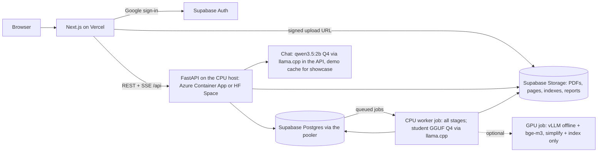
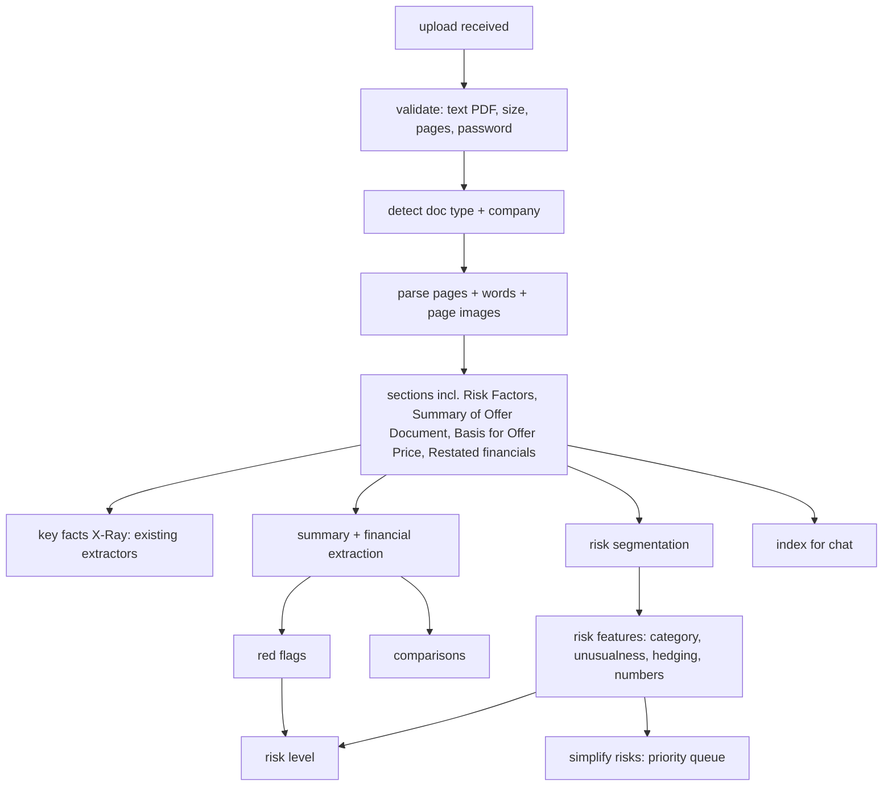

# B02 — Architecture (Big Phase 2)

## 1. Principles (additions to Phase 1 §1)

1. **Same code locally and in the cloud.** Storage, database, queue and LLM sit behind adapters chosen by profile (`dev_light`, `full`, `cloud` = CPU host, `cloud_gpu` = optional GPU path; `deploy_cpu` stays as the showcase-only fallback of ADR-022). No `if cloud:` branches in business logic.
6. **CPU first, cloud-agnostic.** Every stage must run on a CPU host within its free grant; the GPU path is an optional upgrade (B-ADR-04).
2. **Progressive, stage-by-stage results.** Every stage writes its output and an event; the UI renders whatever is ready. A failed stage never deletes earlier results.
3. **Deterministic first, models second.** Red flags and the risk level are rules over extracted values; models extract, classify and simplify; the verifier checks numbers.
4. **Pay only while working.** The API and the worker job scale to zero; the optional GPU path too.
5. **Documents are content-addressed.** `doc_id = sha256(pdf)[:16]`; same file → same report.

## 2. System context



Locally: the same FastAPI app, SQLite instead of Postgres, the local filesystem instead of Supabase Storage, an in-process worker instead of the worker job, Ollama (or llama.cpp) for the LLMs.

## 3. Processing pipeline (per uploaded document)



### 3.1 Stages, outputs and events

| # | Stage id | Output (in `docs/<doc_id>/`) | `detail` in the B06 events (B06 wins on shape) | Budget (CPU host, 600 pages; GPU path in brackets) |
|---|---|---|---|---|
| 1 | `received` | `source.pdf`, metadata row | `{stage, status}` | — |
| 2 | `validated` | — / rejection reason | `{ok, reason?}` | 2 s |
| 3 | `detected` | `doc.json` (type, company, pages) | `{doc_type, company, pages}` | 5 s |
| 4 | `parsed` | `parsed.json`, `pages/*.webp`, `words/*.json` | `{pages_done, pages_total}` (every 50 pages) | 30 s text; page images rendered lazily on first view (Phase 1: 88 s for all 586 pages) |
| 5 | `sections` | `sections.json` | `{found: [...]}` | 5 s |
| 6 | `facts` | `xray.json` | `{ready: true}` | 60 s (ONNX int8) [20 s] |
| 7 | `financials` | `summary.json` | `{ready}` | 30 s |
| 8 | `redflags` | `redflags.json` | `{ready, counts}` | 2 s |
| 9 | `risks_split` | `risks.json` (raw) | `{n_risks}` | 10 s |
| 10 | `risks_scored` | `risks.json` (+ features) | `{ready}` | 60 s (ONNX classifier + bge-m3 int8 on ~80 risks) [30 s] |
| 11 | `risk_level` | `risklevel.json` | `{level}` | 1 s |
| 12 | `simplify` | `risks.json` (+ rewrites, streamed) | `{done, total}` (each item) | top 15 ≈ 4 min (≈ 15 s each); the rest on click [all ≤ 5 min] |
| 13 | `index` | `chunks.jsonl`, `bm25/` (+ `faiss.index` on the GPU path) | `{ready}` | 30 s BM25 [60 s] |
| 14 | `compare` | `compare.json` | `{ready}` | 5 s |
| 15 | `done` / `failed` | `report.json` (assembled) | `{status, failed_stages}` | — |

Stages 6–8, 9–10 and 13 can run in parallel after stage 5. Stage 12 consumes a **priority queue** stored in the database: the top 15 risks by importance are queued automatically; a user click (`POST …/risks/{rid}/simplify`) adds or bumps that risk to the front. After the job finishes, clicked risks are served by a short-lived simplify job (or the API's llama.cpp process on the HF single-container variant).

### 3.2 Document-type handling

| Type | Detection cue (first 3 pages) | Behaviour |
|---|---|---|
| RHP | "RED HERRING PROSPECTUS" (not "DRAFT") | Normal; price-dependent amounts may be `[●]` |
| DRHP | "DRAFT RED HERRING PROSPECTUS" | Banner; many `[●]`; red flags needing prices → "Not available yet" |
| Prospectus | "PROSPECTUS" without "RED HERRING" | Prices filled; preferred for price-dependent checks |
| Unknown | none of the above + missing ≥ 3 key sections | Reject: "This doesn't look like an IPO offer document." |

Showcase IPOs keep both RHP and Prospectus (Phase 1 companion mechanism). The showcase report's **primary doc is the RHP**; its `companion_doc_id` is the Prospectus, which supplies prices for price-dependent checks (RF04 amounts, RF05, RF11). For an uploaded RHP with `[●]` prices, a price-band addendum is parsed if present, else those checks are NA (no price input box). Uploads are single documents; if a user later uploads the Prospectus of a company that already has an RHP report, link them as companions (same company name + issue).

## 4. New and changed packages

| Package | Responsibility | Public API (examples) | Phase |
|---|---|---|---|
| `storage` (new) | `Storage` protocol: `LocalStorage`, `S3Storage` (Supabase Storage or any S3 endpoint); signed upload/download URLs; `GCSStorage` optional later | `get_storage().put/get/url()` | B1.2 |
| `db` (new) | Repository layer (SQLAlchemy 2 Core) over SQLite (local) / Supabase Postgres via the pooler (cloud; prepared statements off); migrations (Alembic) | `docs_repo`, `jobs_repo`, `users_repo` | B1.2 |
| `jobs` (new) | Job model, stage runner, event emitter, priority queue, retries, idempotency | `submit(doc_id)`, `run_stage()`, `events(doc_id)` | B1.2 |
| `auth` (new) | Verify Supabase JWT; per-user limits | `current_user()`, `check_quota()` | B1.5 |
| `ingest.upload` (new) | Validation, dedupe, doc-type detection | `validate_pdf()`, `detect_type()` | B1.1 |
| `parse` (changed) | Robust to unseen layouts; page limit; timeouts | — | B1.1 |
| `summary` (new) | Extract Summary of Offer Document, restated financials, WACA, litigation, RPT, shareholding, peers | `extract_summary(doc)` | B1.3 |
| `redflags` (new) | Rules from `configs/redflags.yaml`; sector awareness | `evaluate(summary, xray) -> list[RedFlag]` | B1.4 |
| `risks` (new) | `segment`, `bank`, `novelty`, `hedging`, `numbers`, `classify`, `seriousness`, `simplify` | `build_risk_report(doc)` | B2 |
| `risklevel` (new) | Points system + corpus-relative thresholds | `compute(redflags, risks) -> RiskLevel` | B2.6 |
| `compare` (new) | Peer table + corpus percentiles | `compare(doc)` | B3.2 |
| `reports` (new) | Assemble `report.json`; caching | `get_report(doc_id)` | B1.2+ |
| `generate` (changed) | Student GGUF through the existing `llama_cpp_backend`; optional `VLLMBackend` (OpenAI-compatible) for the GPU path | — | B2.5a |
| `guard` (changed) | Allow risk-level questions; still refuse buy/apply; forbidden-**phrase** filter (`configs/forbidden_phrases.yaml`) shared by UI copy tests and rewrites | — | B2.3a, B2.6a |

Module contract rule unchanged: import other packages only via `__init__`.

## 5. Schemas (additions to `core/schemas.py`)

Notes against the Phase 1 code: `core/schemas.py` has `Money`, `Count`, `Percent` (no `Amount`) — `Amount` below means `Money | Count | Percent`. Phase 1 `DocType` is `rhp | prospectus` and `core/ids.passage_id` rejects other values: B1.1a adds `drhp`; `unknown` is only a detection result and is never stored. `ParsedDoc` and the showcase store are keyed by `ipo_id`: B1.2 adds `doc_id` beside it and maps showcase docs in `configs/demo_ipos.yaml` (B-ADR-14).

```python
DocType = Literal["rhp", "drhp", "prospectus", "unknown"]
Status3 = Literal["ok", "watch", "concern", "not_available", "not_applicable"]
Level = Literal["low", "medium", "high"]
RiskCategory = Literal["financial", "debt_liquidity", "customers_suppliers", "competition",
  "legal_litigation", "regulatory", "promoters_governance", "operations", "technology_data",
  "market_macro"]

class DocRecord(BaseModel): doc_id: str; sha256: str; doc_type: DocType; company: str | None
    pages: int; uploaded_by: str | None; is_showcase: bool; companion_of: str | None
    created_at: datetime; status: Literal["processing", "ready", "partial", "failed"]

class Job(BaseModel): job_id: str; doc_id: str; stage: str; status: Literal["queued","running","done","failed"]
    progress: dict; error: str | None; started_at: datetime | None; finished_at: datetime | None

class Evidence(BaseModel): doc_id: str; page: int; bbox: BBox | None; sentence: str | None

class SummaryValue(BaseModel): key: str; value: Amount | Percent | Count | str | None
    period: str | None; evidence: Evidence | None; status: Literal["found","placeholder","not_found"]

class FinancialSummary(BaseModel): doc_id: str; currency_unit: str
    revenue: list[SummaryValue]; profit_after_tax: list[SummaryValue]; operating_cash_flow: list[SummaryValue]
    total_borrowings: SummaryValue; net_worth: SummaryValue; waca: list[SummaryValue]
    litigation: dict[str, SummaryValue]; rpt_total: SummaryValue; promoter_holding_post: SummaryValue
    pledged_pct: SummaryValue; customer_top1_pct: SummaryValue; customer_top10_pct: SummaryValue
    peers: list[dict]; auditor_remarks: list[SummaryValue]; is_financial_company: bool

class RedFlag(BaseModel): id: str; title: str; status: Status3; sentence: str
    numbers_used: dict[str, str]; evidence: list[Evidence]; rule: str; points: int

class Risk(BaseModel): rid: str; order: int; title: str; body: str; page_start: int; page_end: int
    category: RiskCategory | None; category_conf: float | None
    novelty: float | None            # share of past IPOs with a similar risk (0–1); lower = more unusual
    nearest_examples: list[dict]     # up to 3 similar past risks (company, year, title)
    hedging: dict                    # {hedge_count, hard_fact: bool, flag: bool}
    numbers: list[Amount]
    seriousness: Literal["high","medium","low"] | None; importance: float | None
    simple: str | None; simple_status: Literal["pending","ready","rejected","failed"]
    simple_checks: list[CheckResult]

class RiskLevel(BaseModel): level: Level; points: int; max_points: int; score: float  # points / max_points over available checks
    percentile: float; checks_available: int
    reasons: list[dict]              # {source: "redflag"|"risk", id, label, points, link}
    thresholds: dict; corpus_n: int; disclaimer_key: str
```

## 6a. Summary and financial extraction (B1.3)

- Anchor on the items that SEBI ICDR requires in the **Summary of the Offer Document** (restated financial summary, auditor qualifications, outstanding litigation table, related-party transactions, weighted average cost of acquisition, pre/post-offer promoter shareholding). They have a regular structure in documents filed since 2018 (WACA tables since 2022).
- Operating cash flow is not in that summary: read it from the restated cash-flow statement pages. Pledges come from the Capital Structure shareholding table; customer concentration from Risk Factors text; peers from Basis for Offer Price.
- Never guess: a value is `found`, `placeholder` (`[●]`) or `not_found`; red flags turn the last two into Not available.
- `is_financial_company`: keyword rules (RBI / NBFC / IRDAI registration, "banking company"); the corpus Excel sector for corpus IPOs.
- Developed on the fixture pack (dev IPOs for tuning), measured on test IPOs (E14 NVM); the 5 unseen RHPs give coverage only (no gold).

## 6. Risk segmentation (B2.1)

- **Uploaded/showcase PDFs:** only inside the Risk Factors section, after its preamble (skip the "Summary of top 10 risk factors" in the Summary section). A new risk starts at a **line-start bold run at the left margin, ≥ 5 words, followed by non-bold text** (from PyMuPDF spans); a number prefix (`^\d{1,3}\.` / `^\(\w+\)`) raises confidence; words inside detected table bboxes never start a risk (bold table headers). The heading ends with a full stop or is ≤ 3 lines long. Merge across page breaks; strip running headers/footers (already done). Sub-headings like "Internal Risks", "External Risks", "Risks Relating to the Offer" become a `group` field, not risks.
- **Corpus texts (no font info):** numbered headings + sentence-shape rules; quality measured separately (E13b, boundaries for 5 of the 20 fixture excerpts).
- Golden tests use **real fixture pages** of 3 dev IPOs, not only synthetic ones.
- Output: `title` (the bold heading), `body` (following paragraphs).

## 7. Risk features and the risk level

### 7.1 Unusualness (risk bank)
- Build once: segment the Risk Factors of all corpus IPOs → `risk_bank.parquet` (company, year, title, body, embedding). **Novelty is computed against the 2018–2023 part of the bank** (newer disclosure styles would otherwise look "unusual" only because they are newer); disclosed in the Lab and About. Embeddings: bge-m3 on the risk **title + first 2 sentences**.
- For a new risk: nearest neighbours (cosine) in the bank; `novelty = share of distinct past IPOs with at least one risk above similarity τ` (τ tuned on dev with spot checks, e.g. 0.80). Show "Found in {x}% of past IPOs" and up to 3 nearest examples.
- Exclude the same company's own past documents from the comparison.

### 7.2 Hedging / softening
- Count hedges ("may", "could", "might", "cannot assure", "there can be no assurance", "adversely affect", "materially") using a lexicon (Loughran–McDonald uncertainty + our own list).
- `hard_fact = true` if the risk contains past-tense facts with numbers (e.g. "we incurred a loss of ₹…", "in Fiscal 2025, 61% of our revenue…").
- `flag = hedge_count ≥ 3 and hard_fact` → UI note: "Written cautiously, but it describes something that has already happened."

### 7.3 Seriousness and importance
- Seriousness (rule-based, transparent): start from the category's base weight (financial, debt, legal, promoters = high base); +1 if `hard_fact`; +1 if a number exceeds a materiality threshold (e.g. ≥ 10% of revenue / net worth when known); −1 if novelty > 0.8 (boilerplate). Map to High/Medium/Low. Teacher-rated seriousness on 300 corpus risks is used only to **check** this rule (E17), not to train it.
- Importance (for sorting) = seriousness weight × (1 − novelty), ties by document order.

### 7.4 Risk level (B2.6)
- Points: each red flag Concern = 2, Watch = 1; each risk that is High seriousness **and** novelty < 0.10 = 1 (max 4 from risks).
- **Normalised score** = points ÷ maximum points possible over the checks that are available (not NA / not applicable) for that document, plus the 4 risk points. Without this, older documents (fewer disclosures, more NA) score low and every new upload skews High (B-ADR-11).
- Thresholds are **corpus-relative** on the **2018–2023 reference population** (ICDR summary formats exist): Low = bottom third, Medium = middle third, High = top third of normalised scores. Store the thresholds in `configs/risklevel.yaml` with the date and `corpus_n`; the UI reads `corpus_n` from there (never a hard-coded 389).
- A config flag `risk_level.behind_click` hides the level behind a click if the teacher asks (B01 §10.2).
- Output always includes reasons with points and links, the percentile ("more disclosed risk than 72% of past IPOs"), and the disclaimer key.

## 8. Simplification service

- Order: the priority queue from §3.1 (top 15 automatic, the rest on click). CPU host: the student as GGUF Q4 via llama.cpp, one at a time (≈ 15 s each); GPU path: vLLM offline, batch 16.
- Prompt contract (student model): input = title + body (+ numbers list); output ≤ 60 words, plain English, keep all numbers and units exactly, keep certainty words, no advice words, no new facts.
- Post-checks, in order: (1) verifier — every number in the rewrite must match a number in the original (same unit); (2) forbidden-words filter (B01 §6); (3) length; (4) certainty check ("may/could" in original must not become definite). Fail → `simple_status = "rejected"`, UI shows the original with a note.
- Fallback model if the student model is unavailable: the base instruct model with the same prompt (flagged in the trace).

## 9. Storage, database, caching

- **Storage layout** (Supabase Storage bucket, or the local `data/` tree): `docs/<doc_id>/{source.pdf, doc.json, parsed.json, pages/, words/, xray.json, summary.json, redflags.json, risks.json, risklevel.json, compare.json, report.json, index/}`; `bank/risk_bank.parquet`. Upload size limit 50 MB per file on the Supabase Free plan.
- **Retention:** 30 days after upload, everything for a non-showcase doc is deleted (files and rows, except the `uploads` counts used for quotas); a later upload of the same file is processed again.
- **Postgres tables** (Supabase via the Supavisor pooler, port 6543, transaction mode; SSE replay polls `job_events` every ~1 s because the pooler has no LISTEN/NOTIFY): `users(id, email, created_at)`, `docs(…DocRecord)`, `jobs(…Job)`, `job_events(job_id, seq, stage, payload, ts)`, `uploads(user_id, doc_id, ts)`, `traces(…)` (Phase 1), `demo_cache`.
- Reports are assembled into `report.json` and served with ETags; showcase reports are cached at the CDN (Vercel) for 1 hour.

## 10. Hosting design (B0.3, B3.3) — CPU first, cloud-agnostic (B-ADR-04, revised 3 Oct 2026)

GCP is postponed (prepayment needed; free-trial accounts get no GPUs). Everything below runs on CPU; §10.3 keeps the GPU design as an optional upgrade.

### 10.1 Default: Azure Container Apps (Azure for Students) + Supabase + Vercel

| Component | Service | Settings |
|---|---|---|
| Frontend | Vercel (Hobby) | `NEXT_PUBLIC_API_URL`, Supabase URL + anon key |
| API | Azure Container App (Consumption plan) | 2 vCPU / 4 GiB, min 0, max 2; no torch; BM25 retrieval; chat model qwen3.5:2b Q4 via llama.cpp (ADR-022 measured this model); demo cache for showcase |
| Worker | Azure Container Apps **Job**, event-driven by a KEDA PostgreSQL scaler on `jobs.status = 'queued'` (no Azure credentials in the API; B0.3 verifies the scaler on Container Apps jobs, fallback: the API starts the job through the management API with a managed identity) | 4 vCPU / 8 GiB (Consumption maximum), timeout 30 min, parallel 1; parse + ONNX int8 extractors/classifier + bge-m3 int8 for risk embeddings + student GGUF Q4 via llama.cpp |
| Storage | Supabase Storage (S3-compatible) | private bucket `docs`; signed upload URLs; 50 MB per-file limit on the Free plan |
| Database + Auth | Supabase (Free) | Google provider; pooler connection string; region Mumbai (`ap-south-1`) if offered, else Singapore |
| Images | GitHub Container Registry | built by GitHub Actions on tags |
| Secrets | Container Apps secrets | DB URL, Supabase service key; never in the frontend or the repo |
| Region | Azure Central India if Container Apps and the Students policy allow it, else Southeast Asia | checked in B0.3 |

**Free grant (per subscription, per month):** 180,000 vCPU-seconds, 360,000 GiB-seconds and 2 million requests on the Consumption plan. One upload on a 4 vCPU / 8 GiB job for ~10 min uses ~2,400 vCPU-s and ~4,800 GiB-s, so about 70 uploads per month fit in the grant before the student credit is used.

### 10.2 Alternative: Hugging Face Docker Space (single container)
API + in-process worker in one container (2 vCPU / 16 GB, free CPU Basic hardware). **Creating a Docker Space now needs HF PRO (about $9/month)**; free accounts can only create ZeroGPU Gradio Spaces. The Space sleeps when idle (first request wakes it in tens of seconds). Kept as the ADR-022 fallback (`deploy_cpu`, showcase-only). B0.3 writes `HOSTING_COMPARISON.md` and Akshat picks.

### 10.3 Optional GPU path (designed, not built unless Akshat says "go")
A GPU job (GCP Cloud Run L4 in asia-southeast1 — Mumbai L4 is invitation-only — or any GPU host) runs **simplify + index only**: vLLM offline engine with the student in AWQ 4-bit loaded from a mounted bucket, plus bge-m3 for dense chat indexes. There is no always-on GPU service. Profile `cloud_gpu`. Cold start (image pull + weight load) is measured, not assumed: expect minutes for an 8B model.

**Cold starts (CPU path):** API ~5–15 s from zero; worker job ~30–60 s (image pull + model load) inside the stage budgets; the UI shows "Warming up the language model" when the first rewrite takes > 20 s.

## 11. Security and abuse prevention

- Uploads require a valid Supabase JWT, verified with the project JWKS (asymmetric keys) and an HS256 fallback, checking `aud = authenticated` and `iss`; per-user (3/day) and global (10/day) limits enforced in the DB; `UPLOADS_ENABLED=false` stops all uploads.
- The client sends a SHA-256; `POST /uploads/{doc_id}/complete` **recomputes it on the server** and rejects a mismatch (422 `hash_mismatch`), so the dedupe can't be poisoned.
- PDFs: size ≤ `uploads.max_mb` (50), pages ≤ 1,500, parse timeout 10 min, processed only inside the worker job (never in the API process).
- Signed, short-lived Storage URLs for page images of non-public uploads; showcase pages public.
- No secrets in the frontend; CORS restricted to the Vercel domains (production + previews); rate limits on chat/voice (Phase 1) and on `…/simplify` per IP.
- Prompt-injection protections (Phase 1) apply to risk texts; rewrites go through output filters.
- Privacy: redaction of personal addresses/contacts (Phase 1 B3 layers) applies to risk bodies before display.

## 12. Cost controls

- CPU host inside its free grant / student credit; Azure budget with alerts at 50 / 90 / 100 % (default ₹2,000-equivalent); HF PRO is a fixed monthly fee.
- Max replicas: API 2, worker 1. All min 0.
- Dedupe by SHA-256; showcase precomputed; 3 uploads/user/day, 10/day global; `UPLOADS_ENABLED` kill switch.
- CPU (and GPU, if used) seconds per upload logged in `jobs.progress.cost_estimate`; shown on `/admin/costs` (Akshat only).
- Nothing is deployed and no paid resource is created without Akshat's explicit "go" in chat.

## 13. Observability

Structured JSON logs (Cloud Logging) with `doc_id`, `job_id`, `stage`, timings; job events in Postgres; a `/api/health` extension showing queue length and last job durations; latency/cost dashboards from logs (E23).

## 14. Testing (additions)

- **Fixture pack** (`tests/fixtures/real/`, B11 §3): real section text + word boxes for the 10 showcase IPOs and 20 corpus Risk Factors excerpts, so most development and tests run in cloud sessions without PDFs or weights. Tests that need full documents or models are marked `@pytest.mark.local` and skipped in cloud sessions and CI.

- Unit tests for every new package; table-driven tests for red-flag rules (each threshold edge).
- Golden tests: segmentation on 3 committed synthetic risk-factor fixtures (bold/numbered/mixed).
- Integration (`slow`): end-to-end local pipeline on 2 showcase IPOs.
- Contract tests for all B06 endpoints; event-sequence tests for job SSE.
- Cloud smoke test script (`scripts/cloud_smoke.py`): upload a small fixture PDF, wait for `done`, check report fields (runs against the local API in CI and against the host after a deploy).
- Postgres-specific tests run in a GitHub Actions `services: postgres` job (`@pytest.mark.postgres`), not in cloud sessions.
- Playwright: upload flow on mocks + on local API; report page states.
